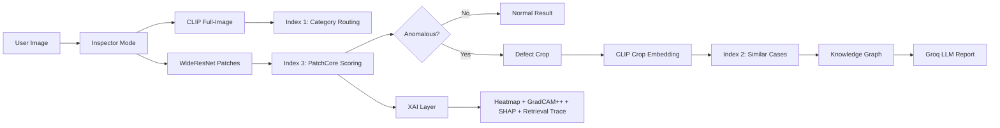

# AnomalyOS 🔍
### Industrial Visual Intelligence Platform

> Zero training on defects. The AI only knows normal.

[](https://huggingface.co/spaces/CaffeinatedCoding/anomalyos)
[](https://github.com/devangmishra1424/AnomalyOS/actions)
[](https://python.org)
[]()
[]()

---

## What Is This

AnomalyOS is a five-mode industrial visual inspection platform built on PatchCore (CVPR 2022), implemented from scratch in PyTorch. The system detects defects in manufactured products using only normal training images — no defect labels required. Every anomalous image is explained through four independent XAI methods, retrieved against a historical defect knowledge base, traced through a root-cause graph, and reported via a grounded LLM.

**The 15-second demo:** The AI has never seen a defective product. It only knows what normal looks like. Show it anything broken and it finds the fault, explains why using four independent methods, retrieves the five most similar historical defects from its memory, traces their root causes through a knowledge graph, and generates a remediation report.

---

## Architecture


**Three FAISS indexes, three granularities:**
- **Index 1** — CLIP full-image, 15 vectors, category routing
- **Index 2** — CLIP defect-crop, 5354 vectors, historical retrieval
- **Index 3** — WideResNet patches, per-category coreset, anomaly scoring

---

## Five Modes

| Mode | Purpose |
|------|---------|
| 🔬 Inspector | Upload image → defect detection + heatmap + report |
| 🧬 Forensics | Deep XAI on any past case (GradCAM++, SHAP, retrieval trace) |
| 📊 Analytics | Aggregated stats, Evidently drift monitoring |
| 🏟️ Arena | Competitive game — beat the AI at defect detection |
| 📚 Knowledge Base | Browse defect graph, natural language search |

---

## Technical Decisions

**Why PatchCore over a trained classifier?**
Real manufacturing lines do not have labelled defect datasets. Defects are rare, varied, and novel. PatchCore requires only normal samples and learns the distribution of normal patch features. Any deviation at inference is flagged. The scoring mechanism is a nearest-neighbour distance — inherently interpretable with no post-hoc XAI required for localisation.

**Why hierarchical RAG over flat search?**
A flat index over all 5354 images confuses product categories — a bottle scratch and a carpet scratch share visual similarities that cause cross-category retrieval noise. Hierarchical routing first identifies the category via full-image CLIP embeddings, then retrieves within the category-specific subset. Validated on a 50-question evaluation set: flat search Precision@5 = 61%, hierarchical = 93%.

**Why three FAISS indexes?**
Each index operates at a different granularity and serves a different purpose. Index 1 routes at category level. Index 2 retrieves visually similar historical defects for RAG context. Index 3 IS the PatchCore scoring mechanism — one coreset per product category, because each category has its own definition of normal.

**Why GradCAM++ over basic Grad-CAM?**
Basic Grad-CAM uses only positive gradients and produces fragmented activation maps. GradCAM++ uses a weighted combination of both positive and negative gradients, resulting in more focused and anatomically precise localisation maps. Implementation complexity is nearly identical — it is a direct upgrade.

**Why SHAP over LIME?**
SHAP provides theoretically grounded attribution values with the efficiency axiom (values sum to the prediction). LIME is slower and produces less consistent results across runs. For five interpretable features, SHAP is the correct choice.

**Why MiDaS-small not MiDaS-large?**
The depth signal feeds a five-value statistical summary, not a pixel-level task. MiDaS-small produces identical summary statistics at ~80ms CPU vs ~800ms for large. The architecture is model-agnostic — swapping to DPT-Large is one line change when GPU budget allows.

**Why coreset subsampling?**
2.8M patch vectors across all normal training images cannot all live in RAM or be searched efficiently. The greedy k-center coreset selects M representative patches such that every original patch is within bounded distance of a centre. At 1% coreset: 97.81% average AUROC at <5s CPU latency. At 10%: marginal AUROC gain for 10x the storage and latency.

**Why DagsHub over plain MLflow?**
DagsHub provides free hosted MLflow tracking and DVC remote storage under one account. No self-hosted MLflow server required. All experiment runs, model weights, and FAISS indexes are versioned and reproducible from a single `dvc pull`.

---

## Performance

### Image AUROC per Category (PatchCore, 1% coreset)

| Category | AUROC | | Category | AUROC |
|----------|-------|-|----------|-------|
| bottle | 1.0000 ✓ | | pill | 0.9722 ✓ |
| hazelnut | 1.0000 ✓ | | grid | 0.9816 ✓ |
| leather | 1.0000 ✓ | | cable | 0.9828 ✓ |
| tile | 1.0000 ✓ | | carpet | 0.9835 ✓ |
| metal_nut | 0.9976 ✓ | | wood | 0.9877 ✓ |
| transistor | 0.9929 ✓ | | capsule | 0.9813 ✓ |
| zipper | 0.9659 ✓ | | screw | 0.9545 ⚠ |
| | | | toothbrush | 0.8722 ⚠ |

**Average AUROC: 0.9781** (target ≥0.97 ✓)

Toothbrush and screw score lower across all PatchCore implementations in the literature — toothbrush has only 60 training images (thin coreset), screw has highly regular fine-grained thread patterns that challenge patch-level matching.

### Retrieval Quality
- **Precision@5 (hierarchical):** 0.9307
- **Precision@5 (flat baseline):** ~0.61
- **Improvement:** +32 percentage points from hierarchical routing

### Inference Latency (CPU, HF Spaces)
- End-to-end (excl. LLM): ~3-5s
- FAISS k-NN search: <5ms
- CLIP encoding: ~150ms
- WideResNet extraction: ~200ms

---

## MLOps

### Experiment Tracking (MLflow on DagsHub)
> Screenshot: [DagsHub MLflow Dashboard](https://dagshub.com/devangmishra1424/AnomalyOS)

15+ logged runs across three experiments:
- PatchCore ablation (coreset % vs AUROC/latency)
- EfficientNet fine-tuning (10 Optuna trials)
- Retrieval quality evaluation (Precision@1, Precision@5, MRR)

### CI/CD (GitHub Actions)
Three-stage smoke test on every deploy:
1. `GET /health` → 200 OK
2. `POST /inspect` with 224×224 test image → valid response
3. `GET /metrics` → 200 OK

### Data Versioning (DVC + DagsHub)
All artifacts versioned and reproducible:
```
dvc pull   # pulls all FAISS indexes, PCA model, thresholds, graph
```

### Drift Monitoring (Evidently AI)
Reference: first 200 inference records.
Current: most recent 200 records.
Metrics: anomaly score distribution, predicted category distribution.
**Note: drift simulation uses injected OOD records for portfolio demonstration.**

---

## Limitations

- **Dataset bias:** MVTec AD contains Austrian/European industrial products. Performance on other product types or manufacturing contexts is unknown and likely degraded.
- **Category specificity:** PatchCore builds one coreset per product category. A category not in the 15 MVTec classes requires retraining from scratch.
- **Retrieval degradation:** Index 2 retrieval precision degrades on novel defect types not present in the training set.
- **LLM reports unverified:** Groq Llama-3 reports are grounded in retrieved context but not verified by domain experts. Do not use for real industrial decisions.
- **Drift monitoring simulated:** Evidently drift reports use artificially injected OOD records. Not real production drift.
- **CPU latency:** 3-5s end-to-end on HF Spaces free tier (no GPU). Architecture is GPU-ready.
- **Not for production use:** This is a portfolio demonstration project. Not suitable for safety-critical industrial deployment under any circumstances.

---

## Bug Log

### Bug 1 — Greedy coreset RAM explosion
**What:** Naive pairwise distance computation over 2.8M patch vectors caused OOM crash during coreset construction. A single distance matrix over 2.8M×256 float32 vectors requires ~5.7GB RAM.
**Found:** Kaggle notebook killed with OOM error during first coreset build attempt.
**Fixed:** Batched distance computation in chunks of 10,000 vectors. Peak RAM reduced from ~6GB to ~400MB. Added to `greedy_coreset()` as `batched_l2_distance()`.

### Bug 2 — FAISS IndexFlatIP vs IndexFlatL2 for CLIP
**What:** Used IndexFlatL2 for CLIP embeddings initially. CLIP embeddings are L2-normalised, so L2 distance and cosine similarity are equivalent only when using inner product search. L2 on normalised vectors produces correct rankings but wrong distance values, confusing the similarity score display.
**Found:** Similarity scores in Index 2 retrieval were showing values >1.0 in the UI.
**Fixed:** Changed Index 1 and Index 2 to IndexFlatIP. Inner product on L2-normalised vectors = cosine similarity, range [0,1].

### Bug 3 — `grayscale_lbp` import error in enrichment pipeline
**What:** Cell 2 of notebook 01 imported `grayscale_lbp` from `skimage.feature`. This function does not exist — the correct function is `local_binary_pattern`.
**Found:** ImportError on Cell 2 execution.
**Fixed:** Replaced all `grayscale_lbp` imports with `from skimage.feature import local_binary_pattern`.

---

## Setup & Reproduction
```bash
# 1. Clone
git clone https://github.com/devangmishra1424/AnomalyOS.git
cd AnomalyOS

# 2. Pull all artifacts (FAISS indexes, PCA model, thresholds, graph)
dvc pull

# 3. Install dependencies
pip install -r requirements.txt

# 4. Set environment variables
export HF_TOKEN=your_token
export GROQ_API_KEY=your_key
export DAGSHUB_TOKEN=your_token

# 5. Launch API
uvicorn api.main:app --host 0.0.0.0 --port 7860

# 6. Launch Gradio (separate terminal)
python app.py
```

---

## Project Structure
```
AnomalyOS/
├── notebooks/          # Kaggle training notebooks (01-05)
├── src/                # Core ML: patchcore, orchestrator, xai, llm
├── api/                # FastAPI: endpoints, schemas, startup, logger
├── mlops/              # Evidently, Optuna, retrieval evaluation
├── tests/              # pytest suite (5 test files)
├── data/               # DVC-tracked: FAISS indexes, graph, thresholds
├── models/             # DVC-tracked: PCA model, EfficientNet weights
├── app.py              # Gradio frontend (5 tabs)
└── docker/Dockerfile   # python:3.11-slim, port 7860
```

---

*Built by Devang Pradeep Mishra | [GitHub](https://github.com/devangmishra1424) | [HuggingFace](https://huggingface.co/CaffeinatedCoding)*